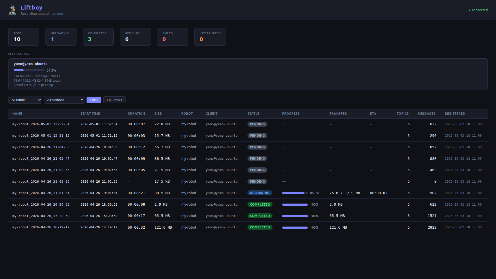
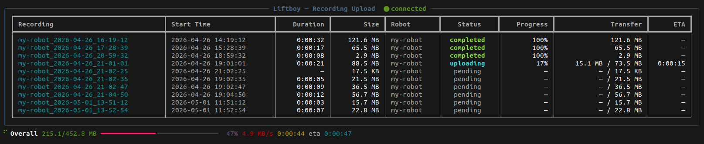

# liftboy

Liftboy manages the full lifecycle of robotics sensor recordings across distributed robots. It automates data uploads to network storage and provides centralized monitoring through a web dashboard.

<p align="center">
    
</p>

---

## Screenshots

**Web dashboard**



**TUI (terminal client)**



---

## Overview

Robot PCs record sensor data locally (e.g. ROS2 mcap files). When you run `liftboy-client`, it discovers all recordings, registers them with the central server, and uploads them one by one via rsync while showing a live TUI progress view. The server tracks the state of every recording and exposes a read-only web dashboard for fleet-wide visibility.

---

## Architecture

```
┌──────────────────────────────────┐  REST API  ┌──────────────────────────────────────┐
│            Robot PC              │ ─────────► │            Central Server            │
│                                  │            │                                      │
│  /data/recordings/               │            │  FastAPI                             │
│  ├── scout_2024-03-15_10-30-00/  │            │  ├── POST /recordings                │
│  └── atlas_2024-03-15_09-00-00/  │            │  ├── PATCH /recordings/{id}/progress │
│                                  │            │  ├── PATCH /recordings/{id}/status   │
│  liftboy-client                  │            │  └── GET  /                          │
│  ├── Scanner + Provider factory  │            │                                      │
│  ├── rsync uploader              │            │  SQLite DB                           │
│  └── Rich TUI                    │            │  └── recordings table                │
│                                  │            │                                      │
└───────────────┬──────────────────┘            │  Web Dashboard (Jinja2)              │
                │ rsync                         │  └── http://<host>:8000/             │
                ▼                               └──────────────────────────────────────┘
       ┌─────────────────┐
       │  Network        │
       │  Storage        │
       │  (NAS/NFS)      │
       └─────────────────┘
```

### Components

**`shared/`** — Pydantic models shared between client and server. These define the data contract: `RecordingMetadata`, `RegisterRecordingRequest`, `UpdateProgressRequest`, `UpdateStatusRequest`, and `RecordingResponse`.

**`client/`** — Runs on each robot PC.

- **Provider factory** (`client/providers/`) — Abstract `RecordingProvider` base class with concrete implementations. `McapRecordingProvider` handles ROS2 mcap recordings and parses the `robot-name_YYYY-MM-DD_HH-MM-SS` folder naming convention to extract metadata. `GenericRecordingProvider` is a catch-all fallback for any folder structure. The `ProviderRegistry` picks the first provider that reports `can_handle()` as true, making the system extensible to new recording formats without touching the upload logic.

- **Scanner** (`client/scanner.py`) — Walks the local storage directory, applies the provider registry to each subfolder, and returns a list of `RecordingMetadata`.

- **API client** (`client/api_client.py`) — Thin HTTP wrapper around the server REST API using `httpx`. Retries up to 3× with exponential backoff; never crashes the upload on server unreachability.

- **Uploader** (`client/uploader.py`) — Wraps `rsync --archive --progress` in a subprocess and parses its stdout to extract progress percentage, bytes transferred, and ETA. Fires a callback on each progress update so the TUI and server stay in sync.

- **TUI** (`client/tui.py`) — `rich.live.Live` view with a per-recording status table and an overall progress bar. Updates in-place without redrawing the terminal.

- **Orchestration** (`client/main.py`) — Ties everything together: scan → register → upload sequentially → update server state → delete local folder on success. SIGINT/SIGTERM handler marks any in-progress recording as `interrupted`.

**`server/`** — Runs on the central server.

- **Database** (`server/database.py`, `server/models.py`) — SQLAlchemy ORM over SQLite. One `recordings` table with all state, progress, and metadata columns.

- **State machine** (`server/crud.py`) — `update_status` enforces valid transitions:
  ```
  pending → uploading → completed   (terminal)
                      → failed      → uploading  (retry)
                      → interrupted → uploading  (resume)
  ```
  Invalid transitions return HTTP 422.

- **REST API** (`server/api/`) — FastAPI routes for registering recordings, reporting progress, and updating status. `POST /recordings` is idempotent (upsert by name), so a client restart does not create duplicate entries.

- **Dashboard** (`server/templates/`) — Jinja2 HTML template served at `GET /`. Auto-refreshes every 5 seconds. No JavaScript framework — pure HTML with inline CSS. Shows all recordings with status badges, progress bars, and ETA. Filterable by robot name and status.

### Recording state machine

| Status | Meaning |
|---|---|
| `pending` | Registered, waiting to upload |
| `uploading` | Transfer in progress (progress % and ETA tracked) |
| `completed` | Upload finished, local copy deleted |
| `failed` | rsync exited with non-zero code |
| `interrupted` | Client disconnected or was killed mid-transfer |

---

## Project structure

```
liftboy/
├── pyproject.toml
├── config/
│   ├── client.example.toml
│   └── server.example.toml
├── shared/
│   └── models.py               # Pydantic models (shared contract)
├── client/
│   ├── main.py                 # Entry point
│   ├── config.py
│   ├── scanner.py              # Folder discovery + ProviderRegistry
│   ├── api_client.py           # HTTP calls to server
│   ├── uploader.py             # rsync wrapper + progress parser
│   ├── tui.py                  # Rich TUI
│   └── providers/
│       ├── base.py             # Abstract RecordingProvider
│       ├── mcap_provider.py    # ROS2 mcap support
│       └── generic_provider.py # Catch-all fallback
└── server/
    ├── main.py                 # FastAPI app + entry point
    ├── config.py
    ├── database.py             # SQLite engine + session factory
    ├── models.py               # SQLAlchemy ORM
    ├── crud.py                 # DB operations + state machine
    ├── api/
    │   ├── recordings.py       # /recordings endpoints
    │   └── health.py           # /health endpoint
    └── templates/
        └── dashboard.html      # Web dashboard
```

---

## Installation

Requires Python 3.10+ and `rsync` installed on client machines.

```bash
pip install -e .
```

This installs both `liftboy-client` and `liftboy-server` entry points.

---

## Usage

### Server

```bash
# Copy and edit config (optional — defaults work out of the box)
cp config/server.example.toml ~/.config/liftboy/server.toml

liftboy-server
```

- Dashboard: `http://<host>:8000/`
- API docs: `http://<host>:8000/docs`

### Client (on each robot PC)

```bash
cp config/client.example.toml ~/.config/liftboy/client.toml
# Set server_url, storage_path, network_path
```

```toml
[liftboy]
server_url          = "http://192.168.1.100:8000"
storage_path        = "/data/recordings"
network_path        = "/mnt/nas/recordings"
delete_after_upload = true
```

```bash
liftboy-client
```

### Environment variable overrides

| Variable | Description |
|---|---|
| `LIFTBOY_SERVER_URL` | Server base URL |
| `LIFTBOY_STORAGE_PATH` | Local recordings directory |
| `LIFTBOY_NETWORK_PATH` | rsync destination |
| `LIFTBOY_DELETE_AFTER_UPLOAD` | `true`/`false` |
| `LIFTBOY_CLIENT_CONFIG` | Path to client config file |
| `LIFTBOY_DB_PATH` | Server SQLite database path |
| `LIFTBOY_HOST` | Server bind host |
| `LIFTBOY_PORT` | Server bind port |
| `LIFTBOY_SERVER_CONFIG` | Path to server config file |

---

## Adding a new recording format

Implement `RecordingProvider` and register it before `GenericRecordingProvider`:

```python
# client/providers/my_format_provider.py
from client.providers.base import RecordingProvider
from shared.models import RecordingMetadata

class MyFormatProvider(RecordingProvider):
    def can_handle(self, folder_path):
        return any(folder_path.glob("*.myext"))

    def extract_metadata(self, folder_path):
        # parse metadata and return RecordingMetadata(...)
        ...
```

```python
# client/scanner.py — build_default_registry()
registry.register(MyFormatProvider())
registry.register(McapRecordingProvider())
registry.register(GenericRecordingProvider())  # always last
```
